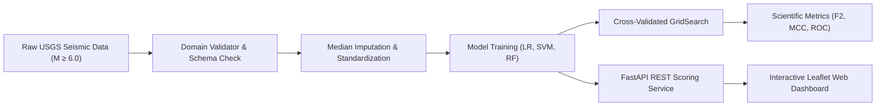

# 🌊 TsunamiSense: AI-Driven Tsunami Early Warning System

[](https://www.python.org/)
[](https://fastapi.tiangolo.com/)
[](https://scikit-learn.org/)
[](LICENSE)
[]()

> **Production Machine Learning Replication of IEEE Research Paper:**  
> *"AI-Driven Classification of Tsunami-Generating Earthquakes: Harnessing Random Forest, SVM, and Logistic Regression for Early Detection"*  
> **Authors:** Imen Ziadi, Nejla Essaddi, and Mongi Besbes (*IEEE Journal of Selected Topics in Applied Earth Observations and Remote Sensing, Vol. 19, 2026*)

---

## 📌 Overview

**TsunamiSense** is an AI-powered seismic classification and early warning decision support system. When an earthquake occurs, traditional hydrodynamic numerical models can take hours to compute ocean wave propagation. **TsunamiSense** ingests basic seismic hypocenter parameters available within minutes of rupture and delivers real-time tsunami risk probabilities and multi-tier early warning alerts.



---

## 🔬 Scientific Methodology & Theoretical Formulations

### 1. Mathematical Core
- **Logistic Regression (Linear Baseline)**:
  $$P(y = 1 \mid X) = \frac{1}{1 + e^{-(\beta_0 + \sum_{j=1}^{p} \beta_j x_j)}}$$
- **Support Vector Machine (RBF Kernel)**:
  $$f(x) = \text{sign}\left( \sum_{i=1}^n \alpha_i y_i \exp(-\gamma \|x_i - x\|^2) + b \right)$$
- **Random Forest Classifier (Ensemble Bagging)**:
  $$\hat{y} = \text{mode} \{ h_1(X), h_2(X), \dots, h_T(X) \}$$
  *Optimized Hyperparameters:* `n_estimators=100`, `max_depth=10`, `min_samples_split=10`.
- **Disaster Mitigation Metric ($F_2$-Score)**:
  $$F_2 = 5 \times \frac{\text{Precision} \times \text{Recall}}{4 \times \text{Precision} + \text{Recall}}$$
- **Matthews Correlation Coefficient (MCC)**:
  $$\text{MCC} = \frac{TP \times TN - FP \times FN}{\sqrt{(TP + FP)(TP + FN)(TN + FP)(TN + FN)}}$$

---

## 📊 Benchmark Results (Replicating Table 1)

Evaluated on unseen stratified test dataset ($N = 296$ test events from USGS 2015–2025):

| Classifier | Accuracy | Precision | Recall (Sens.) | $F_1$-Score | $F_2$-Score | ROC-AUC | PR-AUC | MCC |
| :--- | :---: | :---: | :---: | :---: | :---: | :---: | :---: | :---: |
| **Logistic Regression** | 79.7% | 0.761 | 0.557 | 0.643 | 0.588 | 0.857 | 0.677 | 0.518 |
| **Support Vector Machine** | 84.1% | 0.798 | 0.691 | 0.740 | 0.710 | 0.912 | 0.846 | 0.630 |
| **Random Forest (Champion)** | **88.5%** | **0.862** | **0.773** | **0.815** | **0.789** | **0.940** | **0.892** | **0.735** |

### 🏆 Historical Case Study Validation: 2009 Samoa Earthquake ($M_w\ 8.1$)
- **Actual Event**: 29 Sept 2009 ($M=8.1$, Depth=$18\text{ km}$, Lat=$-15.489^\circ$, Lon=$-172.095^\circ$) $\rightarrow$ Tsunamigenic ($y=1$).
- **Logistic Regression Probability**: **99.92%**
- **Random Forest Probability**: **94.57%**
- **Support Vector Machine Probability**: **89.79%**
- **Consensus Assessment**: `CRITICAL THREAT - HIGH TSUNAMI RISK (WARNING ISSUED)`

---

## 📁 Repository Structure

```text
TsunamiSense/
├── config/
│   └── config.yaml             # Experiment parameters & hyperparameter search space
├── data/
│   ├── raw/                    # USGS harvested earthquake dataset
│   └── processed/              # Serialized imputer & standard scaler
├── frontend/
│   ├── index.html              # Modern dark-mode early warning dashboard
│   ├── style.css               # Responsive glassmorphism UI styles
│   └── app.js                  # Leaflet geospatial mapping & API client
├── models/
│   └── saved_models/           # Serialized LR, SVM, and RF model artifacts
├── reports/
│   ├── figures/                # Figures 1-8 matching the IEEE paper
│   └── metrics_summary.json    # Quantitative benchmark output
├── src/
│   ├── api/app.py              # FastAPI REST endpoints
│   ├── data/                   # USGS harvester and domain validator
│   ├── preprocessing/          # Leak-free median imputation & standard scaling
│   ├── models/                 # Model wrappers (LR, SVM, RF) and GridSearch trainer
│   ├── evaluation/             # Metrics calculator (F2, MCC) & paper visualizers
│   └── inference/              # Production scoring service & case study validator
├── tests/                      # Automated unit test suite (10/10 passing)
├── main.py                     # Unified CLI entrypoint
└── requirements.txt            # Python dependencies
```

---

## 🚀 Quickstart & Installation

### 1. Clone the Repository
```bash
git clone https://github.com/Manju-05/TsunamiSense.git
cd TsunamiSense
```

### 2. Create Virtual Environment & Install Dependencies
```bash
python -m venv venv
# On Windows:
venv\Scripts\activate
# On Linux/macOS:
source venv/bin/activate

pip install -r requirements.txt
```

### 3. Run Automated Unit Tests
```bash
python -m pytest tests/ -v
```

---

## 💻 CLI Usage

### A. Harvest USGS Seismic Data & Preprocess
```bash
python main.py data
```

### B. Generate Paper Figures (Figs 1–3)
```bash
python main.py eda
```

### C. Train & Tune All Classifiers
```bash
python main.py train
```

### D. Run Scientific Benchmark & Samoa Case Study
```bash
python main.py evaluate
```

### E. Predict Single Real-Time Earthquake Event
```bash
python main.py predict --mag 8.1 --depth 18.0 --lat -15.489 --lon -172.095
```

---

## 🌐 Launching the Web Dashboard

Start the local server:
```bash
python main.py serve --port 8000
```
Open **`http://localhost:8000`** in your browser to access:
- **Interactive Global Geospatial Map (Leaflet.js)** with free OpenStreetMap & Bathymetry tiles.
- **Dynamic Seismic Parameter Sliders** (Magnitude, Depth, Coordinates).
- **1-Click Historical Presets** (2009 Samoa, 2011 Tohoku, 2004 Indian Ocean, 2023 Turkey, 2024 Noto).
- **Live Multi-Model Probability Gauges** & **Consensus Alert Banners**.
- **Embedded Research Figures & Benchmark Viewer**.

---

## 📜 Citation

If you use this work, please cite the original research paper:

```bibtex
@article{ziadi2026ai,
  title={AI-Driven Classification of Tsunami-Generating Earthquakes: Harnessing Random Forest, SVM, and Logistic Regression for Early Detection},
  author={Ziadi, Imen and Essaddi, Nejla and Besbes, Mongi},
  journal={IEEE Journal of Selected Topics in Applied Earth Observations and Remote Sensing},
  volume={19},
  pages={8441--8447},
  year={2026},
  doi={10.1109/JSTARS.2026.3664318}
}
```

---

## 📄 License
This project is open-source and licensed under the [MIT License](LICENSE).
